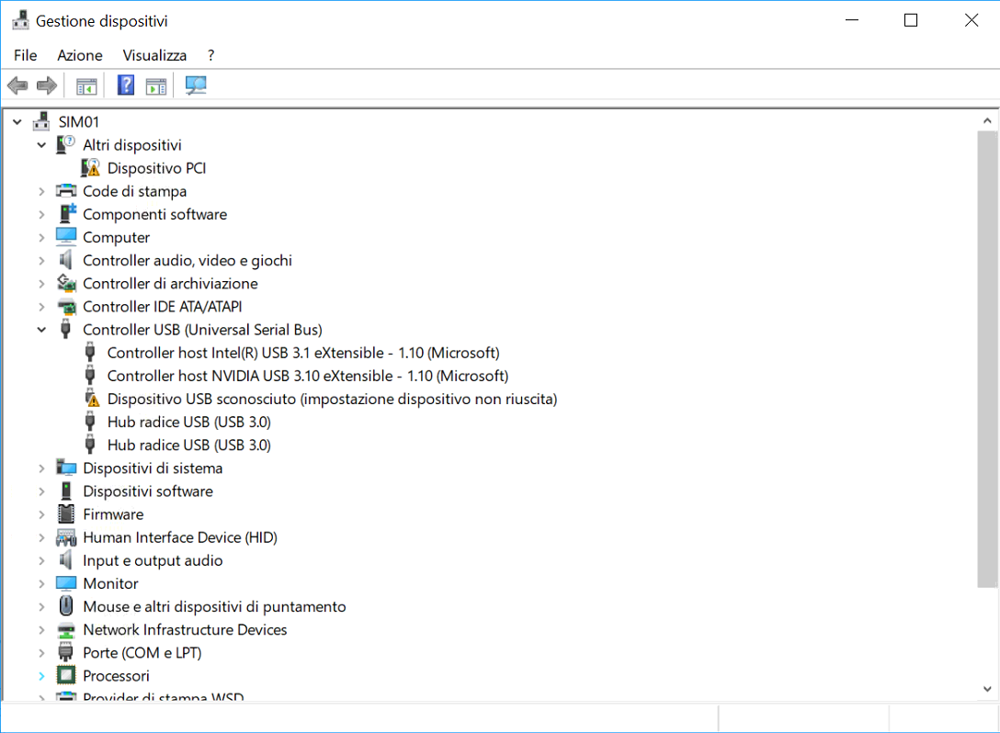

# USB_RESET_INTEL_REALSENSE_435

With this application .bat, you can solve an annoyng issue related to Intel RealSense when it connected to an USB 3.1 port 

# Windows 10 Pro

- Intel Real Sense Driver  : [https://downloadcenter.intel.com/download/28723/Intel-RealSense-D400-Series-Universal-Windows-Platform-UWP-Driver-for-Windows-10](Version: 6.1.160.14 (Latest) Date: 4/1/2019)

- Intel Real Sense Firmware : [https://downloadcenter.intel.com/download/28573/Latest-Firmware-for-Intel-RealSense-D400-Product-Family](Version: 5.11.4 (Latest) Date: 2/12/2019)

- install DevCon

If you get "No Devices Found."" in device manager you can run this .bat. Basically by using [Windows Device Console](https://docs.microsoft.com/en-us/windows-hardware/drivers/devtest/devcon) ( devcon.exe ) you can enable, disable, install, configure, and remove devices.
DevCon is a command-line tool that displays detailed information about devices on computers running Windows.

